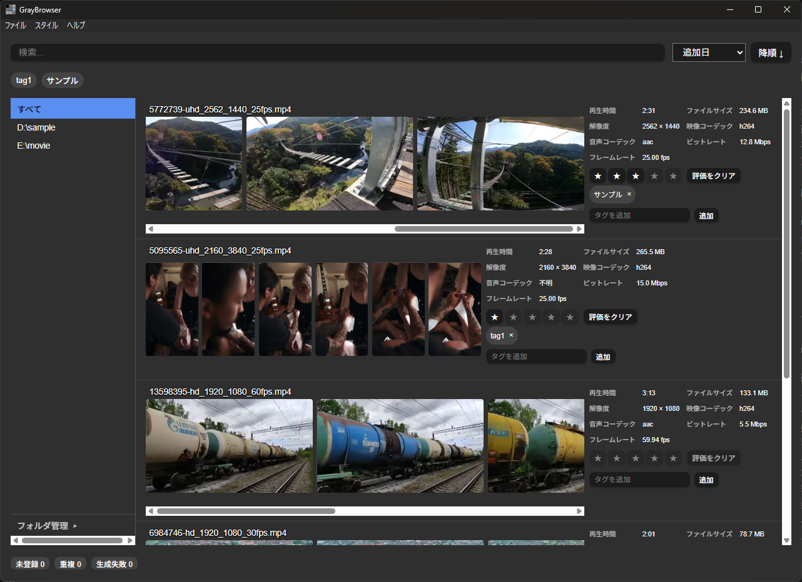
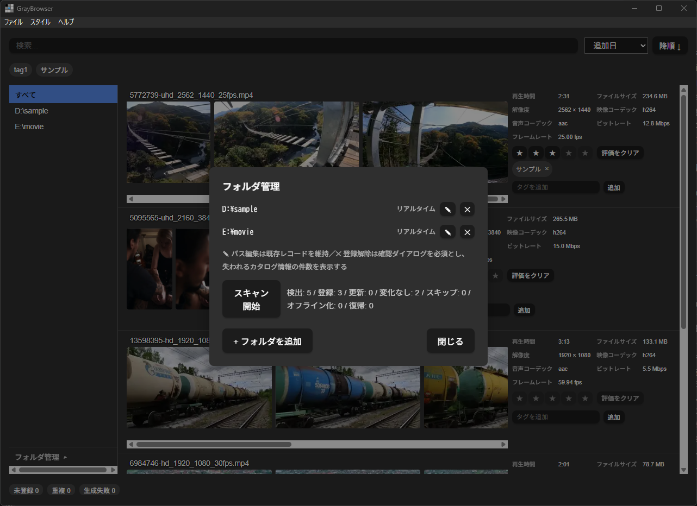
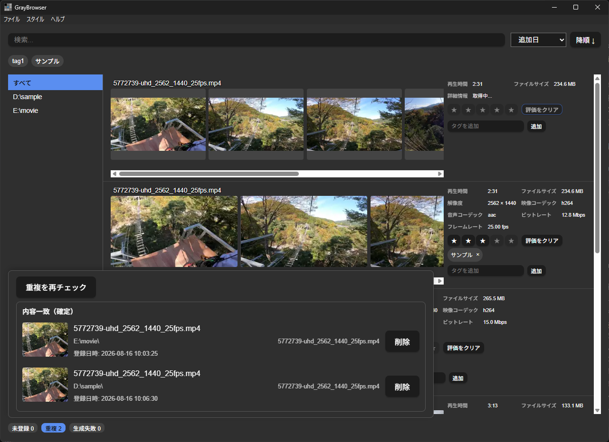

# GrayBrowser


[](LICENSE)
[](https://github.com/becchi78/GrayBrowser/actions/workflows/ci.yml)
-orange.svg)

大量のローカル動画ファイルを高速にスキャン・カタログ化し、タグ付け・レーティング・検索で整理できる、Windows向けのローカル動画管理デスクトップアプリです。

開発が停止したローカル動画管理ソフト「WhiteBrowser」の後継として、現代のPC環境・動画フォーマットに合わせて再構築しました。旧WhiteBrowserで不満の大きかった「ファイル追加時の検知・登録の遅さ」を解消し、大量の動画ファイルをストレスなく管理できることを目標にしています。

## ⚠️ 開発版に関する注意

現在のバージョンは **0.1.0(開発版)** です。破壊的変更や未発見の不具合が含まれる可能性があります。大切な動画ファイルを扱う前に、DBのバックアップなど自己責任での対策を推奨します。本番的な運用(このアプリのカタログ情報を唯一の管理手段にする等)は現時点では推奨しません。

## 目次

- [スクリーンショット](#スクリーンショット)
- [主な機能](#主な機能)
- [動作環境](#動作環境)
- [インストール](#インストール)
- [使い方](#使い方)
- [開発者向けセットアップ](#開発者向けセットアップ)
- [アーキテクチャ・技術スタック](#アーキテクチャ技術スタック)
- [コントリビューション](#コントリビューション)
- [スポンサー・寄付](#スポンサー寄付)
- [ライセンス](#ライセンス)
- [謝辞](#謝辞)

## スクリーンショット

| メイン画面 | フォルダ管理 | 重複ファイル検出 |
|---|---|---|
|  |  |  |

## 主な機能

- **フォルダ登録・自動スキャン** — 指定した複数フォルダ配下の動画ファイルを検出し、データベースに登録します。
- **リアルタイム監視・自動追従** — ローカルドライブはファイルシステムイベントで即座に反映、NASなどのネットワークドライブは起動時差分スキャン＋定時ポーリングで検知します。ファイルの移動・ドライブレター変更にも自動追従します。
- **オフラインカタログ保持** — 外付けHDDなど未接続の媒体上の動画も、レコードとサムネイルを保持したまま「オフライン」として一覧に残します。
- **サムネイル自動生成** — FFmpegを使い、動画の代表シーン(再生時間の10%地点)からサムネイルをバックグラウンド生成します(WebP形式)。
- **メタデータ取得** — FFprobeで解像度・コーデック・再生時間などを取得し、プロパティとして表示します。
- **重複ファイル検出** — ハッシュ値(quick_hash → full_hash)に基づき重複ファイルを検出し、一覧表示します(自動削除はせず、削除はユーザー操作で行います)。
- **インクリメンタル検索・ソート** — ファイル名・かな・ローマ字を横断したリアルタイム検索、タグ絞り込み、各種ソート(ファイル名・追加日・評価など)。
- **タグ管理・レーティング** — 動画ごとに複数タグの付与・削除、星1〜5のレーティングが可能です。
- **タグバー(常設タグ)** — よく使うタグをブックマークバーのように常設し、1クリックで絞り込めます。常設タグの並び順は固定され、選択中のタグも一時的にバーへ表示されます(バーに収まらない分は▾から選択可能)。常設タグの追加・並べ替えは「ファイル > タグバーの編集...」から行います。
- **旧WhiteBrowser(.wb)データ移行** — `.wb`ファイルをパースし、パス・タグ・レーティング・旧サムネイルを本アプリへインポートできます。
- **ダークモード対応**

以下は対象外の機能です: アプリ内動画再生・スキン機能、Webリンクからの自動ダウンロード、音楽/画像/書庫ファイルの管理、CSV一括編集、再生回数・視聴日記録。

## 動作環境

- **OS:** Windows(64bit)
- **FFmpeg / FFprobe:** ⚠️ **本アプリには同梱されていません。** 事前にインストールし、PATHが通っている必要があります(サムネイル生成・メタデータ取得に使用)。未検出の場合はアプリ起動時に画面上で案内されます。
- **動画再生プレイヤー:** ⚠️ **本アプリには同梱されていません。** 動画再生はOS標準または任意の外部プレイヤー(設定画面で指定可能)に委譲します。
- **WebView2 Runtime:** Tauriアプリの表示に使用します(多くのWindows環境には標準で入っています)。

## インストール

[Releases](https://github.com/becchi78/GrayBrowser/releases/latest) ページから最新のインストーラー(`GrayBrowser_x.y.z_x64-setup.exe`)をダウンロードし、実行してください。管理者権限は不要です(ユーザー単位でインストールされます)。

> 開発版のため、現時点ではリリースが存在しない場合があります。ソースからのビルドは [開発者向けセットアップ](#開発者向けセットアップ) を参照してください。

## 使い方

1. アプリを起動し、「フォルダを追加」から動画が入っているフォルダを登録します(複数登録可)。
2. 「スキャン開始」でフォルダ内の動画を検出・登録します。以降は新規ファイルの追加も自動的に検知されます。
3. サムネイルとメタデータはバックグラウンドで自動生成され、順次グリッドに反映されます。
4. 検索ボックスにファイル名の一部を入力すると、リアルタイムで絞り込まれます。タグでの絞り込みや、ファイル名・追加日・評価などでのソートも可能です。
5. 各動画の詳細欄からタグの付与・削除、レーティング(星1〜5)の設定ができます。
6. 動画をダブルクリック(またはメニューから再生)すると、OS標準または設定した外部プレイヤーで再生されます。
7. 重複ファイルが検出されると一覧に表示されます。削除は自動では行われず、内容を確認したうえで手動で行います。
8. 旧WhiteBrowserのデータがある場合は、「.wbインポート」から `.wb` ファイルと旧サムネイルフォルダを指定して移行できます。

より詳しい使い方ガイドは、以下を順次追加予定です(準備中、リンク先は未作成):

- [インストールと初期設定](doc/getting-started.md)(準備中)
- [フォルダ登録・スキャンの詳細](doc/folder-scan.md)(準備中)
- [タグ・レーティングの活用法](doc/tags-and-rating.md)(準備中)
- [重複ファイルの管理](doc/duplicate-files.md)(準備中)
- [旧WhiteBrowser(.wb)からの移行](doc/wb-import.md)(準備中)

## 開発者向けセットアップ

```bash
# 依存関係のインストール
npm install

# 開発モードで起動(ホットリロード)
npm run tauri dev

# ビルド(インストーラ生成)
npm run tauri build
```

その他の主なコマンド:

```bash
# Lint / 型チェック / フロントエンド単体テスト
npm run lint
npm run typecheck
npm run test:unit

# Rust側のフォーマット・Lint・テスト
cargo fmt --check --all
cargo clippy --all-targets --workspace -- -D warnings
cargo test --all-features --workspace

# E2Eテスト(tauri-driver使用、手動実行)
npm run test:e2e
```

開発はWindows実機(またはWindows VM)を前提としています。

## アーキテクチャ・技術スタック

- **アプリフレームワーク:** Tauri v2(Rust + React/TypeScript + Vite)
- **データベース:** SQLite3(`rusqlite`、WALモード)
- **動画解析:** FFmpeg / FFprobe(PATH参照)
- **プロジェクト構成:** Cargoワークスペース(`crates/gb-core` = OS非依存ロジック、`src-tauri` = Windows/Tauri依存層)

コーディング規約・開発フローは [`CLAUDE.md`](CLAUDE.md) を参照してください。

## コントリビューション

不具合の報告・機能拡張の要望は [Issue](https://github.com/becchi78/GrayBrowser/issues/new/choose) にお願いします。

一緒に開発してくれる方も歓迎します。興味があればIssueやPull Requestでお気軽にご連絡ください。

## スポンサー・寄付

本プロジェクトはAI(Claude Code)を活用して個人開発者が開発・保守しています。継続的な開発にかかる費用を支援していただける方は、以下から寄付を受け付けています。

- [GitHub Sponsors](https://github.com/sponsors/becchi78)
- [Ko-fi](https://ko-fi.com/becchi78)

## ライセンス

[MIT License](LICENSE)

## 謝辞

- 本アプリは、開発が停止したローカル動画管理ソフト「WhiteBrowser」の後継として開発されました。
- [Tauri](https://tauri.app/)・[FFmpeg](https://ffmpeg.org/)をはじめとする、本アプリが依存するオープンソースソフトウェアに感謝します。
