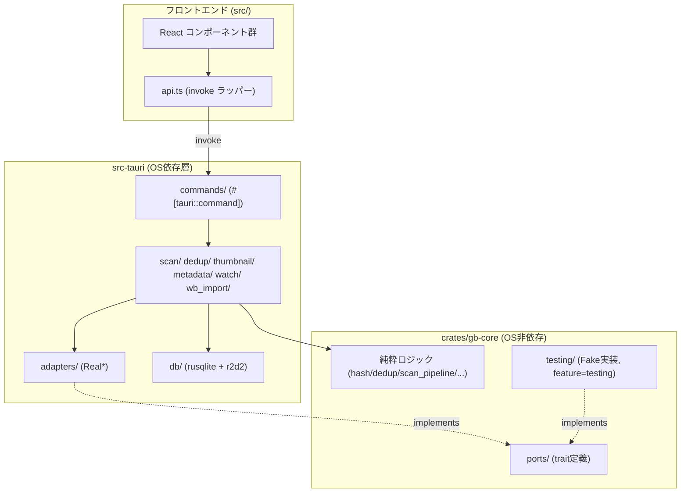

# アーキテクチャ概要

GrayBrowserの実装がどう組み立てられているかを俯瞰するための文書。詳細な規約は各スキル(`db-schema-change`, `media-ingestion`, `github-workflow`等)と`CLAUDE.md`を参照し、本文書はそれらの「地図」として使う。

## 1. 全体像

Tauri v2アプリで、フロントエンド(React + TypeScript)とバックエンド(Rust)がIPC(`invoke`)で繋がる構成。バックエンドはCargoワークスペースとして2つの層に分かれている。

依存の向きは一方向: `gb-core`は`src-tauri`を一切知らず、`tauri`/`rusqlite`/`notify`/`windows-sys`に依存しない。`src-tauri`が`gb-core`に依存し、そのportトレイトを実アダプタで実装する。

## 2. 技術スタックとCargoワークスペース構成

ルート`Cargo.toml`は3クレートのワークスペース:

- `crates/gb-core` — OS非依存ロジック。依存は`xxhash-rust`・`blake3`・`thiserror`・`regex`のみ(`cargo tree`で確認済み、`tauri`/`rusqlite`/`notify`/`windows-sys`は一切含まれない)。
- `src-tauri` — Tauriアプリ本体。`tauri`(v2)・`rusqlite`(bundled)・`r2d2`/`r2d2_sqlite`・`notify`・`windows-sys`・`gb-core`(path依存)などを持つ。
- `crates/wb-anonymize-tool` — 旧`.wb`形式DBを読み取り、テスト用フィクスチャとして匿名化したデータを書き出す独立CLI。こちらも`tauri`には依存しない。

`gb-core`・`src-tauri`ともに`testing` cargo featureを持つ。`src-tauri`(graybrowser crate)は自クレートを`dev-dependencies`に`features=["testing"]`付きで自己参照しており、これによって自身のtestingフィーチャが`cargo test`実行時に自動的に有効化される。一方`gb-core`にはこの自己参照は無く、`gb-core`のtestingフィーチャはCI(`ci.yml`の`pr-checks`ジョブ等)や`cargo test --all-features --workspace`のように`--all-features`を明示的に付けることで有効化している。

## 3. gb-core / src-tauri の分離原則

`crates/gb-core/src/lib.rs`冒頭のドキュメントコメントが原則そのもの: *「このクレートは`tauri`・`rusqlite`・プロセス起動系クレートに依存してはならず、`#[cfg(windows)]`を含んではならない」*。

`gb-core/src/`の主なモジュール:

| モジュール | 役割 |
| --- | --- |
| `hash.rs` | `quick_hash`(xxHash64、先頭/末尾1MB+サイズ)、`full_hash`(BLAKE3全体) |
| `dedup.rs` | quick_hash一致 → full_hash一致、の二段階重複グルーピング |
| `filename_validation.rs` | 機種依存文字の検出(Unicode範囲の純粋関数) |
| `scan_pipeline.rs` | `validate()` → `build_new_video()` の二段階スキャン判定 |
| `reconcile.rs` | スキャン結果と既知データの突合(新規/既知/パス追従/オフライン化) |
| `thumbnail_policy.rs` | 動画長に対する6フレーム等間隔シーク位置ポリシー |
| `retry.rs` | サムネイル/メタデータ生成の再試行可否判定 |
| `migrations.rs` | マイグレーション適用順序を決める純粋ロジック |
| `sort.rs` | `ORDER BY`を生成してよい唯一の場所(`SortField`/`SortDirection`) |
| `search.rs` / `tags.rs` / `rating.rs` / `watch_folders.rs` | 検索語分割、タグ名正規化、評価値レンジ検証、監視フォルダのマージ |
| `wb_import.rs` / `wb_sampling.rs` / `wb_anonymize.rs` | `.wb`インポート変換・フィクスチャ用サンプリング・匿名化 |

これらはすべて`impl Read`/`Read+Seek`等の抽象や純粋な値に対して動作するため、実ファイル・実DB無しで単体テスト可能。

## 4. Ports・Adapters・Fakeパターン

OS依存処理を足す箇所は必ず「`gb-core/src/ports/`にtrait定義 → `src-tauri/src/adapters/`に実装 → `gb-core/src/testing/`にFake」の三点セットになる。現在7つのport(`dialog`, `drive_type`, `ffmpeg`, `player`, `watcher`, `wb_file`, `wb_source`)がこの形を踏襲している。

例: `FfmpegAdapter`

- **trait定義**: `crates/gb-core/src/ports/ffmpeg.rs` — `check_available`/`probe_duration`/`extract_thumbnail`/`probe_metadata`/`convert_image_to_webp`。`Path`と`thiserror`のみに依存。
- **実アダプタ**: `src-tauri/src/adapters/ffmpeg.rs`の`RealFfmpegAdapter`。`ffmpeg`/`ffprobe`をPATH上のバイナリとして引数配列で起動し(シェル文字列は使わない)、`CREATE_NO_WINDOW`でコンソールのちらつきを抑える。
- **Fake**: `crates/gb-core/src/testing/fake_ffmpeg.rs`の`FakeFfmpegAdapter`。メソッドごとに差し替え可能な結果/クロージャと呼び出し履歴(`Mutex<Vec<FakeCall>>`)を持ち、「計算済みシーク位置では失敗、0秒フォールバックでは成功」のようなシナリオをテストできる。

**例外**: `CatalogNotifier`/`DedupNotifier`/`WbImportNotifier`は`gb-core/src/ports/`に置かれていない。実装が本質的に`tauri::AppHandle`依存であり、`gb-core`に持ち出すとフレームワーク依存が漏れるため、trait・実装・Fakeを`src-tauri/src/events.rs`にまとめて置いている(`events.rs`冒頭コメントに理由あり)。

## 5. コマンド層の設計

`#[tauri::command]`関数は薄いラッパーとし、実処理は独立した(Fake注入可能な)関数に切り出す。理由: 実`tauri::AppHandle`を`cargo test`内で構築するとWindows上で`STATUS_ENTRYPOINT_NOT_FOUND`でクラッシュするため、コマンド本体を直接unit testできない。

- `src-tauri/src/commands/settings_cmds.rs`: `pick_and_merge(picker: &impl FolderPicker, ...)`という薄い関数を`FakeFolderPicker`で直接テストし、`#[tauri::command] pick_watch_folders(...)`はその関数を呼びつつ実`State<Db>`/`AppHandle`周りの配線のみ担当する。
- `src-tauri/src/commands/generation_retry_cmds.rs`: `retry_thumbnail_generation`等のコマンドは、`thumbnail::worker::generate_thumbnail_for_video(ffmpeg: &impl FfmpegAdapter, ...)`のような、そもそもジェネリックでFake注入可能なworker関数をそのまま呼ぶ設計にすることで、コマンド層を経由せずにテストできるようにしている。

## 6. データベース層

- **接続/プール**: `src-tauri/src/db/mod.rs`の`Db`構造体は書き込み用`Arc<Mutex<Connection>>`と読み取り用`r2d2::Pool`を持つ(単一ライター・複数リーダー)。`init()`はFK制約を無効化(`bundled` SQLiteがデフォルトでFKをONにするため、参照整合性はアプリ層で担保する方針)、`PRAGMA journal_mode=WAL`を設定、マイグレーションを実行してからプールを構築する。
- **マイグレーション**: SQLファイルは`src-tauri/migrations/0001_initial.sql`〜`0008_add_thumbnail_ready.sql`。`src-tauri/src/db/migrations.rs`が`include_str!`で埋め込み、適用順序の判定自体は`gb-core::migrations`の純粋ロジックに委譲、全マイグレーションを1トランザクションで適用する。
- **スキーマ**: `videos`(`id` TEXT PRIMARY KEY = UUID v4)・`tags`・`video_tags`・`schema_version`・`skipped_files`・`settings`・`path_collisions`(0006で追加)。0002以降、`mtime`列(変更検知)、ffprobeメタデータ列、`created_at`/`rating`インデックス(実測ベース、`sort_index_usage.rs`で検証)、再試行カウンタ、`thumbnail_ready`キャッシュフラグ(10万件規模でのファイル`stat()`コスト対策)などが段階的に追加されている。
- 詳細な変更手順は`db-schema-change`スキルを参照。

## 7. 動画取り込みパイプライン

1. **スキャン**: `src-tauri/src/scan/mod.rs`が`walkdir`でフォルダを走査し、`gb_core::scan_pipeline`の`validate()`(機種依存文字チェック含む)→`build_new_video()`という純粋な判定フローに実ファイルI/Oを絡めて実行する。同じ`process_detected_file`エントリポイントを手動スキャン・ローカルリアルタイム監視(`watch/mod.rs`)・NASポーリング(`watch/nas_poll.rs`)が共有する。
2. **ハッシュ**: まず`quick_hash`(xxHash64、先頭/末尾1MB+ファイルサイズ)を計算。重複候補として`(quick_hash, file_size)`が一致した組のみ、`dedup/mod.rs`が`full_hash`(BLAKE3、ファイル全体)を計算して確定判定する(全件に対して重いハッシュを回さない二段階方式)。
3. **メタデータ**: `src-tauri/src/metadata/worker.rs`が`FfmpegAdapter::probe_metadata`を呼び、幅/高さ/コーデック/ビットレート/fps等をDBに書き戻す。
4. **サムネイル**: シーク位置は`gb-core/src/thumbnail_policy.rs`の純粋ロジック(動画長の1/7〜6/7地点で6枚、長さ不明時は0秒にフォールバック)が決定し、`src-tauri/src/thumbnail/worker.rs`が`FfmpegAdapter::extract_thumbnail`を実行してWebP(低品質設定)で書き出す。6枚すべて成功して初めて`.tmp`から本番ファイルへアトミックにリネームする。
5. **重複時の再突合**: パス追従・オフライン化などの分類は`gb-core::reconcile`の純粋ロジックが行う。

外部プロセス呼び出し(ffmpeg/ffprobe)は必ず引数配列で行い、シェル文字列を組み立てない。詳細な規約は`media-ingestion`スキルを参照。

## 8. フロントエンド構成

- エントリポイント: `src/main.tsx` → `src/App.tsx`。ルーティングライブラリは使わず、単一ビュー+モーダルダイアログ(`FolderDialog`, `WbImportDialog`)というシンプルな構成。状態管理はReactの`useState`/`useEffect`のみ(Redux等は不使用)。
- `src/api.ts`が唯一のIPC境界: すべての`invoke()`呼び出しをここに集約し、コマンド名とRustの`snake_case`→JSの`camelCase`変換をこの1箇所だけで扱う。
- `src/events.ts`: メニューイベントや`catalog:changed`等のTauriイベント購読ラッパー。
- `src/components/`: 機能単位のReactコンポーネント群(`ThumbnailGrid`, `TagEditor`, `DuplicateGroupsPanel`等)。
- `src/lib/`: 純粋なTSユーティリティ(同居する`.test.ts`でテスト)。

## 9. CI/CD

`.github/workflows/ci.yml`:

- `pr-checks`(全PRで実行、`ubuntu-latest`): `gb-core`のみを対象にした`fmt`/`build`/`clippy`/`test`と、フロントエンドの`lint`/`typecheck`/`test:unit`。`gb-core`はOS非依存なのでLinux上で安価に検証できる。
- `checks`/`build`/`e2e`/`release`(いずれも`windows-latest`、`workflow_dispatch`または`v*`タグ契機): ワークスペース全体のビルド・テスト、`npm run tauri build`によるインストーラ生成、`tauri-driver`+`msedgedriver`によるE2E、GitHub Releaseへのドラフト作成。

`windows-latest`ランナーを使うのは、アプリ自体がWindows API(WebView2・MSVCビルド前提)に依存するため。`cargo audit`は`Cargo.lock`とCVE DBの突合のみで実行環境を問わないため`.github/workflows/audit.yml`として`ubuntu-latest`で分離して回している。
